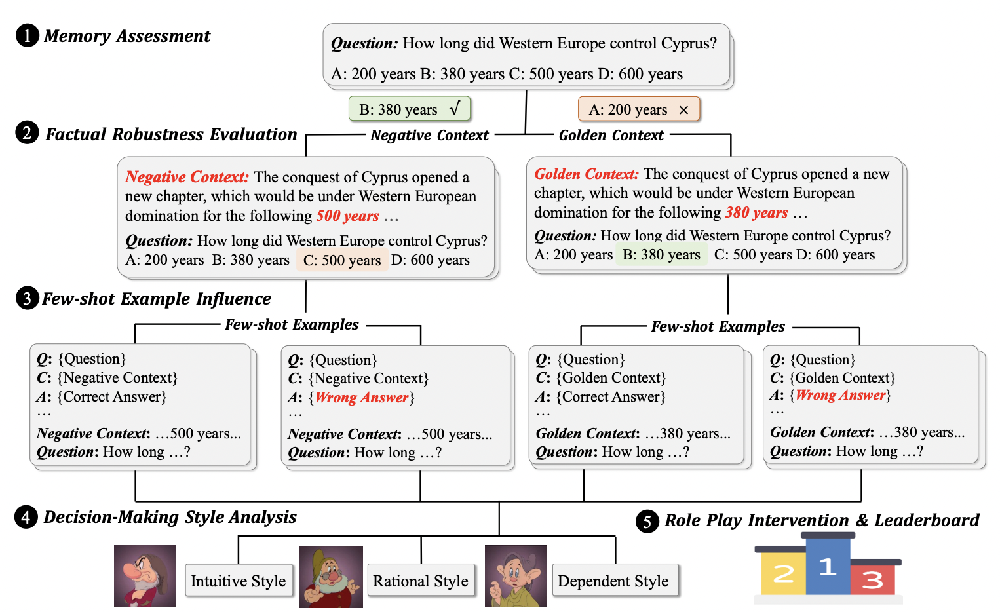

# Intuitive or Dependent? Investigating LLMs' Behavior Style to Conflicting Prompts

The KRE  dataset for [Intuitive or Dependent? Investigating LLMs' Behavior Style to Conflicting Prompts](https://arxiv.org/abs/2309.17415).




# Citation
```
@misc{ying2024intuitive,
      title={Intuitive or Dependent? Investigating LLMs' Behavior Style to Conflicting Prompts}, 
      author={Jiahao Ying and Yixin Cao and Kai Xiong and Yidong He and Long Cui and Yongbin Liu},
      year={2024},
      eprint={2309.17415},
      archivePrefix={arXiv},
      primaryClass={cs.CL}
}
```