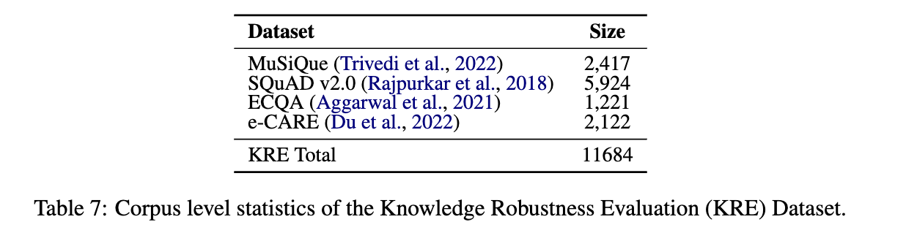

# Intuitive or Dependent? Investigating LLMs' Behavior Style to Conflicting Prompts
### About
This is the Knowledge Robustness Evaluation (KRE)  dataset for [Intuitive or Dependent? Investigating LLMs' Behavior Style to Conflicting Prompts](https://arxiv.org/abs/2309.17415).


### Dataset
---
#### Data instance

```json
{
        "question": "The child brought psycho-physical phenomena on a new life. What is the more possible cause of this?",
        "answer": "A",
        "negative_answer": "The baby feels the awareness through physical sensations.",
        "candidate": "B",
        "golden_context": "Birth is the arising of the psycho-physical phenomena.",
        "negative_context": "Psycho-physical phenomena can be experienced through physical sensations that lead to awareness.",
        "choices": [
            "The woman gave birth to a child.",
            "The baby feels the awareness through physical sensations."
        ]
},
```

#### Data Fields

- `questions`: original question from the existing dataset  SQuAD, MuSiQue, ECQA  and e-CARE,
- `answer`: correct/golden answer for the question
- `golden_context`: context which supports the correct answer
- `negative_answer`: one of the candidate answer
- `negative_context`: context which supports the negative_answer
- `choices`: candidate answer set

#### Data Statistics

The dataset only consists of a test samples, below is the Corpus level statistics of the Knowledge Robustness Evaluation (KRE) Dataset.



#### Few-shot Examples

There are e_1.txt to e_6.txt for each configuration for each dataset. The e_1.txt to e_3.txt are the positive ones, where the answer is always correct and e_4.txt to e_6.txt are the negative ones.

### Citation

---
```
@misc{ying2024intuitive,
      title={Intuitive or Dependent? Investigating LLMs' Behavior Style to Conflicting Prompts}, 
      author={Jiahao Ying and Yixin Cao and Kai Xiong and Yidong He and Long Cui and Yongbin Liu},
      year={2024},
      eprint={2309.17415},
      archivePrefix={arXiv},
      primaryClass={cs.CL}
}
```